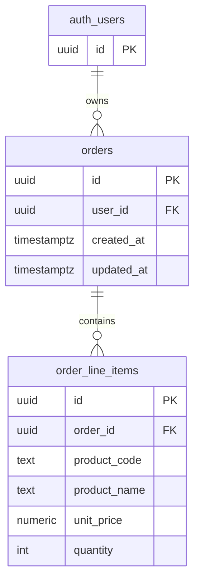

**Tiêu đề**: Mô hình dữ liệu — Quản lý đơn hàng (Supabase / PostgreSQL)  
**Doc-ID**: DM-BH-ORD-001  
**Owner**: Tech Lead / DBA  
**Phiên bản**: 0.1 **Trạng thái**: Draft **Cập nhật lần cuối**: 2026-03-30  
**Liên quan**: SRS, API `API-Supabase-QuanLyDonHang-v0.1.md`

---

## 1. Tổng quan

- **CSDL**: PostgreSQL (Supabase).
- **Quan hệ**: Một `orders` có nhiều `order_line_items`.
- **Cô lập dữ liệu**: `orders.user_id` = `auth.uid()`; RLS trên cả hai bảng.

---

## 2. Thực thể và thuộc tính

### 2.1 Bảng `orders`

| Cột | Kiểu | Ràng buộc | Mô tả |
|-----|------|-----------|--------|
| `id` | `uuid` | PK, default `gen_random_uuid()` | Định danh đơn. |
| `user_id` | `uuid` | NOT NULL, FK → `auth.users(id)` | Chủ sở hữu. |
| `created_at` | `timestamptz` | NOT NULL, default `now()` | Thời điểm tạo. |
| `updated_at` | `timestamptz` | NOT NULL, default `now()` | Cập nhật (trigger). |

**Index**: `orders(user_id)`, `orders(created_at DESC)`.

### 2.2 Bảng `order_line_items`

| Cột | Kiểu | Ràng buộc | Mô tả |
|-----|------|-----------|--------|
| `id` | `uuid` | PK, default `gen_random_uuid()` | Định danh dòng. |
| `order_id` | `uuid` | NOT NULL, FK → `orders(id) ON DELETE CASCADE` | Thuộc đơn nào. |
| `product_code` | `text` | NOT NULL | Mã sản phẩm. |
| `product_name` | `text` | NOT NULL | Tên sản phẩm. |
| `unit_price` | `numeric(14,2)` | NOT NULL, CHECK ≥ 0 | Giá đơn vị (VND). |
| `quantity` | `integer` | NOT NULL, CHECK > 0 | Số lượng. |
| `line_total` | `generated always as (unit_price * quantity) stored` | optional | Tổng dòng (tiện báo cáo). |

**Index**: `order_line_items(order_id)`.

---

## 3. RLS (Row Level Security)

### 3.1 Bật RLS

```sql
ALTER TABLE public.orders ENABLE ROW LEVEL SECURITY;
ALTER TABLE public.order_line_items ENABLE ROW LEVEL SECURITY;
```

### 3.2 Policy mẫu `orders`

- **SELECT**: `user_id = auth.uid()`
- **INSERT**: `user_id = auth.uid()`
- **UPDATE**: `user_id = auth.uid()`
- **DELETE**: `user_id = auth.uid()`

### 3.3 Policy mẫu `order_line_items`

Chỉ cho phép nếu đơn cha thuộc user:

```sql
-- Ví dụ: EXISTS (select 1 from orders o where o.id = order_line_items.order_id and o.user_id = auth.uid())
```

Áp dụng cho SELECT, INSERT, UPDATE, DELETE tương ứng.

---

## 4. Trigger `updated_at` (orders)

Dùng trigger BEFORE UPDATE set `orders.updated_at = now()` (pattern chuẩn Supabase).

---

## 5. Migration

- Mọi thay đổi schema qua **Supabase Migration** (SQL trong repo `supabase/migrations/`).
- Không sửa tay production ngoài quy trình migration.

---

## 6. `profiles` (tùy chọn)

Nếu cần hiển thị tên hiển thị:

| Cột | Kiểu | Ghi chú |
|-----|------|---------|
| `id` | uuid PK | = `auth.users.id` |
| `display_name` | text | |
| `created_at` | timestamptz | |

RLS: user chỉ đọc/sửa dòng `id = auth.uid()`. Có thể tạo trigger sau khi signup (`handle_new_user`).

---

## 7. Phân loại dữ liệu & retention

| Thực thể | PII | Ghi chú retention |
|----------|-----|-------------------|
| `auth.users` | Có (email) | Theo Supabase & chính sách dự án. |
| `orders` / `order_line_items` | Không mặc định | Giữ đến khi user xóa hoặc policy retention (TBD). |

---

## 8. Sơ đồ quan hệ (Mermaid)



---

## 9. Lịch sử thay đổi

| Phiên bản | Ngày | Mô tả |
|-----------|------|--------|
| 0.1 | 2026-03-30 | Khởi tạo mô hình MVP |
